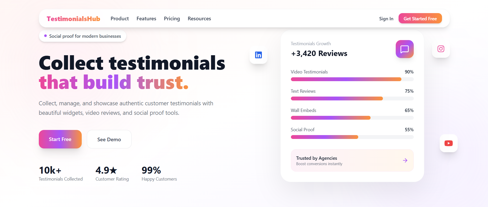

<h1 align="center">👋 Hi, I'm Sandeep Kumar Ulaganathan</h1>

  <strong>Backend Engineer • AI/ML Engineer • SaaS Builder</strong> 
  I build scalable backend systems, AI-powered products, cloud-native APIs, and production-ready SaaS platforms.

  
  

---

## 🚀 About Me

I am a **Backend Engineer and AI/ML Engineer** focused on designing and building scalable digital products.

My work mainly revolves around:

- Building **SaaS platforms** from idea to production
- Designing **REST APIs, authentication systems, dashboards, and billing workflows**
- Developing **AI-powered automation and analytics systems**
- Creating clean, scalable backend architectures using **Python, Django, FastAPI, Node.js, and cloud infrastructure**

Currently, I am building:

- ⭐ **Testimonials Hub** — customer testimonial collection and social proof platform  
- 🔮 **Astrology API Platform** — API-based astrology services platform  

---

# ⭐ Featured Product: Testimonials Hub

  

## What is Testimonials Hub?

**Testimonials Hub** is a SaaS platform that helps businesses collect, manage, approve, and display customer testimonials beautifully on their websites.

It is designed for founders, agencies, creators, service businesses, startups, and product teams who want to build trust using real customer feedback.

### Core Features

- 🎥 Collect video testimonials
- 📝 Collect text testimonials
- ⭐ Capture ratings and reviews
- 🌐 Generate public testimonial collection links
- 🧩 Embed testimonial widgets on websites
- 📊 Track testimonial and review performance
- ✅ Approve, reject, and manage submitted testimonials
- 👥 Support teams, workspaces, and business users
- 🔐 Secure authentication and dashboard experience

  

---

# 🛠 Tech Stack & Tools

## 🚀 Languages

## ⚙ Backend Frameworks

## 🧠 AI / ML

## ☁ Cloud & DevOps

## 🗄 Databases

---

# 🧩 What I Build

<table>
<tr>
<td width="50%">

## SaaS Platforms

- Authentication systems
- Subscription workflows
- Admin dashboards
- User workspaces
- Analytics systems
- Payment integrations
- Embeddable widgets
- API-first products

</td>
<td width="50%">

## AI & Backend Systems

- AI agents
- Data pipelines
- LLM integrations
- Vector search systems
- Backend APIs
- Automation engines
- Cloud deployments
- Scalable architectures

</td>
</tr>
</table>

---

---

# 🚀 Current Focus

I am currently focused on building production-grade SaaS products with strong backend foundations, clean UI workflows, AI-powered automation, and scalable cloud deployment.

My main product focus right now is:

  

---

<h3 align="center">⭐ Building products that help businesses grow with trust, automation, and scalable technology.</h3>
